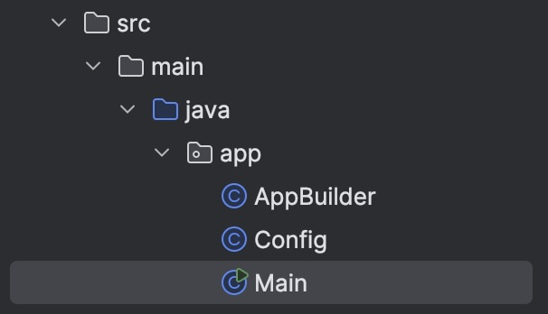
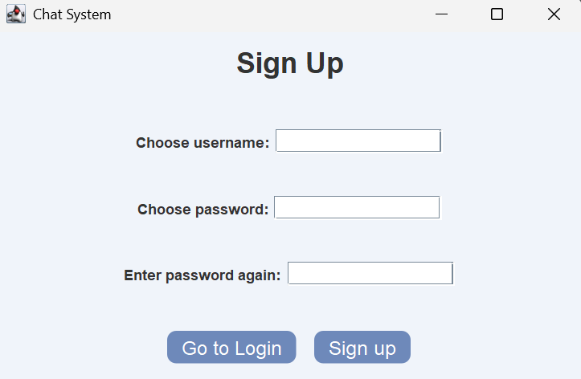
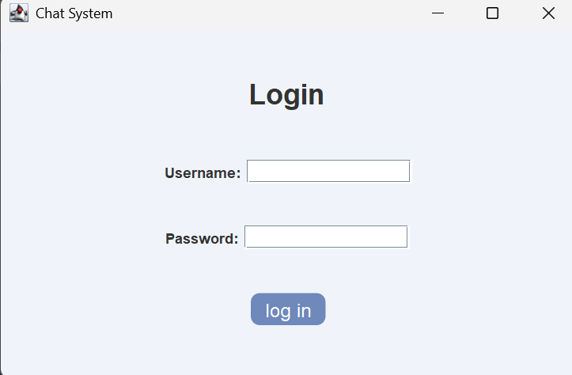
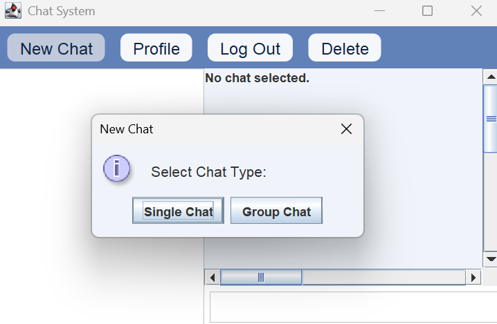
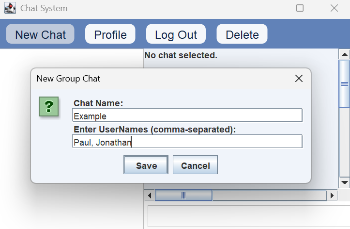
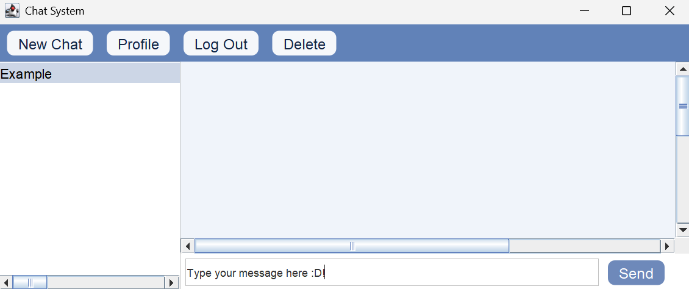
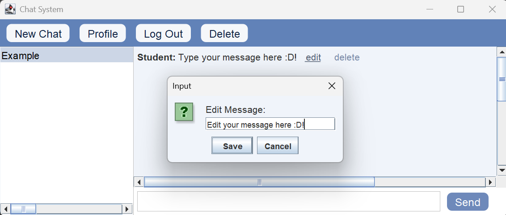

# Chat System with SendBird API 

### Authors: Herena Li ([herenali](https://github.com/herenali)), Jaycee Law ([jayceelaw](https://github.com/jayceelaw)), Lavender Lo ([LavenderLO](https://github.com/LavenderLO))

## Project Summary 
This project is a chat system that incorporates the SendBird API. It allows users to create 
accounts, manage group chats, send and receive messages, and edit past messages. Additionally, users can 
interact with others in real time through the app’s messaging system. Our goal is to provide a simple, user-friendly 
interface for group messaging and individual communication, with features that enhance user experience. It solves the need for
a user-friendly platform where people can communicate easily and efficiently in real time. This project is useful for anyone
looking for a straightforward way to manage conversations and stay connected.

## Table of Contents
1. [Features](#features)
2. [Installation Instructions](#installation-instructions)
3. [Usage Guide](#usage-guide)
4. [License](#license)
5. [Feedback](#feedback)
6. [Contributions](#contributions)

## Features
Core Features: 
- **User Account Management**: Create, log in, and log out of user accounts.
- **Messaging**: Send, receive, and delete messages within chats. Messages update for all participants when edited.
- **Group Chat Creation**: Create or delete group chats with custom names and member lists.
- **Group Chat Selection**: Select which pre-existing group chat to open and view from the side panel.
- **Edit Sent Messages**: Edit message content after sending them.

Integrated API: 
- **Sendbird Chat API**: Handles messaging and chat-related functionality.

## Installation Instructions
1. **Clone the Repository**  
   Use Git to clone the repository to your local machine:
   ```bash
   git clone https://github.com/herenali/CSC207ProjectRepo.git
2. Navigate to project directory and install dependencies using Maven
   - if this doesn't work, right-click pom.xml file -> Maven -> Reload project
3. There is a default API token set in the project, but you can change them to a custom one by following these steps:
   1. Create an account or sign in to the [Sendbird Dashboard](https://dashboard.sendbird.com/)
   2. Create an application following the instructions
   3. Click into the application and navigate to Settings -> General to find the API Token and Application ID 
   4. In the project files, navigate to src -> main -> java -> app -> Config.java
   5. Replace the apiToken and appId strings with your own
   ```bash
    public static final String apiToken = "YOUR_API_TOKEN";
    public static final String appId = "YOUR_APP_ID";
4. Run Main.java in src/main/java/app to initiate the chat system
   - Right click on the file in the project directory and click "Run 'Main.main()'"


Notes:
- This project runs on Java 22 and uses the Oracle OpenJDK 22.0.1 software development kit (SDK).
- This project can be installed and run on any OS and hardware system.

## Usage Guide
1. Sign Up or Log In (using your username and password).




2. Create a Chat (either single or group).




3. Send Messages
- Select a chat from the side panel, type your message in the input box, 
and hit the send button.



4. Edit Messages 
- Select a message you sent, click the edit message button '...', update its content and save the changes.



## License 
Creative Commons Legal Code

CC0 1.0 Universal

 CREATIVE COMMONS CORPORATION IS NOT A LAW FIRM AND DOES NOT PROVIDE
 LEGAL SERVICES. DISTRIBUTION OF THIS DOCUMENT DOES NOT CREATE AN
 ATTORNEY-CLIENT RELATIONSHIP. CREATIVE COMMONS PROVIDES THIS
 INFORMATION ON AN "AS-IS" BASIS. CREATIVE COMMONS MAKES NO WARRANTIES
 REGARDING THE USE OF THIS DOCUMENT OR THE INFORMATION OR WORKS
 PROVIDED HEREUNDER, AND DISCLAIMS LIABILITY FOR DAMAGES RESULTING FROM
 THE USE OF THIS DOCUMENT OR THE INFORMATION OR WORKS PROVIDED
 HEREUNDER.
    
The full license is in our repository (https://github.com/herenali/CSC207ProjectRepo/blob/main/LICENSE). 

## Feedback
 Please share your feedback through this [Google Form](https://docs.google.com/forms/d/e/1FAIpQLSdOlmT7c9pwKURW5UtzZlsilaJc4CuWSx9LaYJjVjzzRQOrZA/viewform?usp=sf_link)

Rules for Valid Feedback:
   - Constructive: Provide suggestions for improvement or change that we can implement
   - Specific: Describe the issue or suggestion clearly with enough detail to understand the context
      - if possible, provide screenshots, code snippets, or examples to support your feedback.
   - Relevant: Ensure the feedback pertains to the specific project or feature in question

Guidelines on What to Expect:
   - Acknowledgment: You will receive an email confirmation that we've received your Google Form submission 
   - Response time: We aim to review and address feedback within a few weeks, depending on complexity 

## Contributions 
To add/modify code:
1. Fork the Repository 
- Go to our repository (https://github.com/herenali/CSC207ProjectRepo.git). 
- Fork the project to create your own copy. 
2. Implement Changes
- Work on a separate branch to add your modifications. 
- Ensure your code: 
  - is correct and adheres to SOLID principles and Clean Architecture. 
  - includes sufficient test cases. 
3. Submit a Pull Request 
- Create a pull request to the main branch for review

To review other's code:
- Make sure their code is organized, well-documented, and correct
- Add comments and manually resolve conflicts when merging, if necessary
