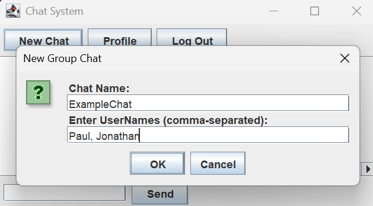

Messaging App with SendBird API (Authors: )

## Summary of the project’s purpose
Our messaging app program is designed to provide an efficient and reliable platform for communication between individuals and groups. 
The program allows users to sign up, log in/ out of accounts, and create/ delete chats with other users. Users can send, receive, edit messages within chats. 
Whether it is for coordinating with a team on a group project, connecting with friends, or XXX, our project aims to simplify communication and ensure everyone 
can stay engaged an dinformed, making it a valuable tool for fostering connection and ensuring productivity. 

## Table of contents
1. Team Use Case - 

## Features of the software

## Installation instructions

This is a minimal example demonstrating usage of the
password-protected user part of the API used in lab 5.

You can find more information about the API endpoints in
[the documentation](https://www.postman.com/cloudy-astronaut-813156/csc207-grade-apis-demo/documentation/fg3zkjm/5-password-protected-user).

If your team is considering an application for which it would be convenient to
store data in something like a database, you may find that the API calls demonstrated
here will be useful in your project, as this will allow you to store
an arbitrary JSON object associated with a username and password.

In this application, a single note has a name (the "username" in terms of the API) and the note
can be read by anyone who knows the name — but only edited by someone who
knows the password for it.

You can see the documentation in the various files for more information.

## Testing

The repo also includes an example of a use case interactor test, as well as
an example of an end-to-end test which automates button clicks and inspects
the contents of the actual views. This is something we discussed in the lectures
about testing in CA but had not provided a code example of before. Note, one
could also inspect the contents of the ViewModel objects instead when testing
CA to make a similar test which would be less dependent on the details of the
specific UI implementation.

## Project Starter Code

Your team may choose to use this repo as starter code for your project. You could
also use the lab 5 code — or start from an empty repo if your team prefers.

If you choose to use one of the repositories we have provided, you can either make
a fork of it or copy the subset of code you want into a completely new repository.
